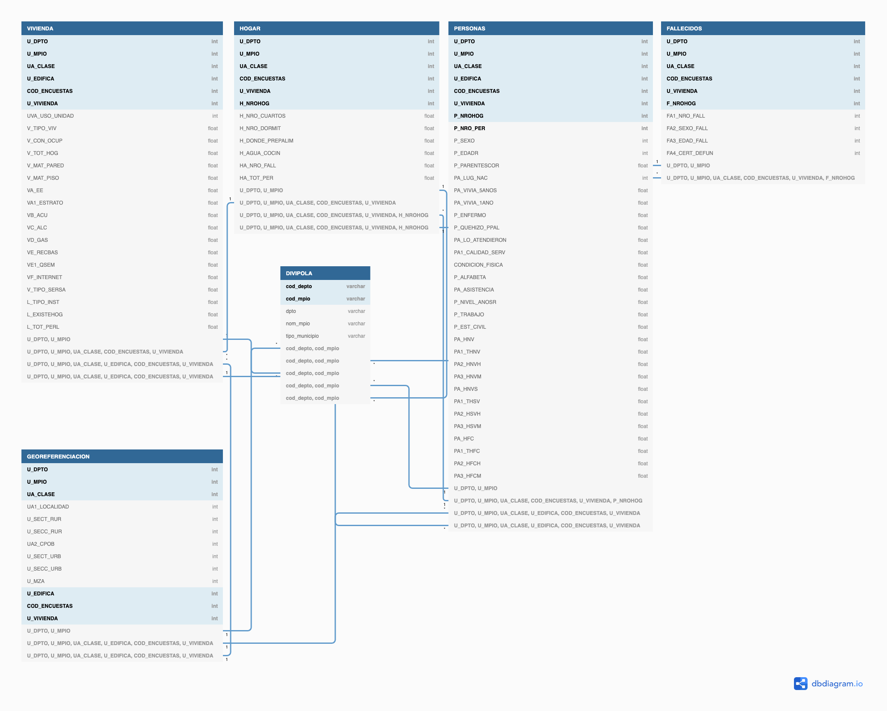

# Data Engineer Project

## Project Summary
Relation COVID data with Census data for Colombia:

### Objetives
- To obtain a clean dataset for Colombia.
- To have a clean dataset to combine and do further analysis for Colombia not only related with COVID.
- To do some Analytics and identify vulnerable zones.
- To do estimates about mortality rates acoording to the zone.
- To predict how the curve will evolve and identify pain zones.
- To estimate UCI capacity in Colombia and how it is evolving.

## Datasets
### Colombia CENSUS 2018
Gather from the microdata of DANE (Statistics Colombian Institute) from main (Most affected but COVID) Departments or States: 
- Antioquia
- Bogota
- Atlantico
- Meta
- Caldas

The data is obtained from: http://microdatos.dane.gov.co/index.php/catalog/643/get_microdata.

Each folder department contains 5 general tables:
- VIVIENDAS: Information about physical homes like: Type of home, City, Number of people, Materials of the building, Public Servics, etc.
- HOGARES: Information about homes: Number of rooms, kitchen available, water to cook, people deceased in home, number of people, etc.
- FALLECIDOS: Deceased people info like: Number of people, Gender, Age of death, Has death medical certificate.
- PERSONAS: People information like: Gender, Age, Relation with home head, City of Birth, Home 5 years ago, Home 1 year ago, Health issues, Treatment, Dificulties, Alphabetism, Education Level, Work, Civil Status, Sons, Sons out of Colombia, etc.
- GEOREFERENCIA: Identifiers inside a Colombia, Department, City, Comuna, Urban area, Rural area, Neighborhood, Building number.

**Notes:**
- Rename Atlantico Folder: 08_AtlanticoCSV -> 08_Atlantico_CSV
- Look at other formating issues in other departments, the format should be ##_Name_CSV

### DIVIPOLA
Colombia official national division by departments and cities. Mapping between codes and its names.
Obtained from: https://www.datos.gov.co/widgets/gdxc-w37w through an API

### Colombia COVID-19 dataset
Gather from INS (Instituto Nacional de Salud - Natinal Instute of Health)
National Information about COVID 19 cases.

The data is obtained here: 
- https://www.datos.gov.co/Salud-y-Protecci-n-Social/Muestras-procesadas-de-COVID-19-en-Colombia/8835-5baf/data
- https://www.datos.gov.co/Salud-y-Protecci-n-Social/Casos-positivos-de-COVID-19-en-Colombia/gt2j-8ykr/data

The information here corresponds to:
- COVID-19 samples proocessed by Department/Main City
- COVID-19 positive cases with age, city, recovered, severity, nexus, gender, death. This is the main source for COVID 19. This data is obtained  throgh the API from the INS.

## Scope of the project
The aim of this project is to combine the Census data and Covid 19 data:
- To have a clean and complete dataset from Colombia Census and COVID-19 (Data Lake).
- To identify vulnerable people.
    - Old people (>65 years old)
    - People wthout access to water or bad food conditions
    - Bad medical attention
    - Among others.
- To identify zones where this vulnerable people are located to focus the health attention on those places and gather UCIs to that cities
- To estimate changes on expected life with COVID-19, comparing with 2017 deaths.
- To have census data aggregated by city in order to join with the covid data for a complete analysis for each city.

## Exploring data
### Knowing the data
At first the data is displayed in jupyter in order to identify and clarify what a column means, filter columns that will not be useful, and clean the data according to nulls or similar things.

The explorations are found:
- Census data can be found at [Exploration_Census.ipynb](./notebooks/Exploration_Census.ipynb)
- Covid-19 cases can be found at [Exploration_covid.ipynb](./notebooks/Exploration_covid.ipynb)

### **CENSUS**
The census data is structured in 6 tables (One called DIVIPOLA to map the id with city names which is obtained through Socrata API)

#### Preprocessing
- The tables are without duplicates according to the [documentation](http://microdatos.dane.gov.co/index.php/ddibrowser/643/export/?format=pdf&generate=yes).
- There is an index  in the tables which refers to the "Número de HOGAR" (H_NROHOG, F_NROHOG, P_NROHOG) which is float because it has null values. To have only integers (easier for joining) those nulls are repaced by a special key (99) which did not appear, and is easier to identify and join. Note: this nulls are not supossed to appear accoring to the docs (Which ttells that this column has values between 0 and 35).

#### Data Model of this data
Here we have a hierarchical data. The hierarchy is the following:
- VIVIENDA: is compound of multiple HOGAR (Dimension Table)
    - HOGAR: has many people and death people assocciated to it (Dimension table)
        - PERSONAS: All the people in each HOGAR (Fact table)
        - FALLECIDOS: All the deaths associated to a HOGAR (Fact table)

And we have some auxiliar tables:
- GEOREFERENCIACIÓN: information about places, building, locations, etc. Associated to VIVIENDA and HOGAR (Dimension Table)
- DIVIPOLA: information about the municipalities and departments. (Dimension Table)

The diagram of this db is the following
.

The dbdiagram description is [here](./resources/DataModel.sql)

#### Process of data
- First we had to identify the unique keys and how to do the proper join, even though the dataset is almost ready for the joining.
- In the same exploration notebook is an example of the joining for an "small" department.
    - There are some quality checks that are going to be used
- We are going to do the following with this data:
    - Combine all departments data into one big table with all the census information and save to s3 for further information or needings.
    - Do mutiple aggregations by city to combine with the covid data and save to s3
- All of this process is going to be executed in Spark as it is faster, and can handle easily big data. Also it is scalable as more departments are added. This data will be stored in s3 partitioned by department (Doesn't matter if it is skewed as you may want an specific city or department)

##### Aggregations by city used:
**Personas**
- VA_EE: 1 Servicio Electrico. Porcentaje de personas con acceso a energia electrica.
- VA1_ESTRATO: [0-6, 9] Porcentaje de personas por estrato
- VB_ACU: Servicio de acueducto. Porcentaje de personas con acceso a acueducto.
- VF_INTERNET: Servicio de Internet
- HA_TO_PER: Promedio de personas por hogar
- P_EDADR: [0-4, 5-9, 10-14, 15-19, .. >100] Piramide poblacional por ciudad.
- P_ALFABETA: Porcentaje de alfabetismo
- PA1_CALIDAD_SERV: Promedio calidad de servicio de salud [1-4 ]
- P_NIVEL_ANOSR: Personas por nivel educativo (Porcentaje por nivel) [1-9, 10 Ninguno, 99 No informa, NA]
- PA1_THFC: Número de hijos q viven fuera de Colombia

**Fallecidos**
- FA2_SEXO_FALL: Porcentaje fallecidos hombres
- FA3_EDAD_FALL: Edad al morir Promedio de edad al morir (Expectativa de Vida)
- FA2_SEXO_FALL&FA3_EDAD_FALL: Expectativa de vida por sexo
- VA1_ESTRATO&FA3_EDAD_FALL: Expectativa por Estrato
- UA_CLASE&FA3_EDAD_FALL: Expectativa por Clase municipal (1 -Cabecera, 2-Centro poblado, 3-Rural Disperso, 4-Resto Rural)
    
### **COVID**
The covid data are two tables: COVID-19 general data for Colombia and the covid-19 test samples data. Both of them are gather from the Socrata API. It is updated daily.

Here is the documentation for both of them
- [General](https://dev.socrata.com/foundry/www.datos.gov.co/gt2j-8ykr)
- [Test](https://dev.socrata.com/foundry/www.datos.gov.co/8835-5baf)

#### Preprocessing
- When reading this table, some type issues emerged. Finding the type for each column was necessary and fixing some of them.
- A column (symptom onset date) has different types (Time stamp and varchar for asymptomatics). This was divided in two columns one for time stamp and another for the asymptomatic indicator.
- The DIVIPOLA code for department was not the equal to the codigo department in the dataset. DIVIPOLA is going to be used as it was also used in the Census.
- This two tables are going to be cleaned and uploaded to s3 as part of the data lake, and to be used in the joining with spark.

##### Aggregations by city used:
**COVID**
- FA2_SEXO_FALL: Porcentaje fallecidos hombres
- FA3_EDAD_FALL: Edad al morir Promedio de edad al morir (Expectativa de Vida)
- FA2_SEXO_FALL&FA3_EDAD_FALL: Expectativa de vida por sexo
- VA1_ESTRATO&FA3_EDAD_FALL: Expectativa por Estrato
- UA_CLASE&FA3_EDAD_FALL: Expectativa por Clase municipal (1 -Cabecera, 2-Centro poblado, 3-Rural Disperso, 4-Resto Rural)

## Execution steps of the complete PIPELINE:
1. Download the Census data into the data directory under `censo` name.
2. Unzip the Census data and select only the desired departments.
3. Run from the root `python src/load_censo.py`to upload the desired census data to s3
4. Run from the root `python src/load_covid.py`to clean and upload the covid data data to s3
5. Run from the root `python src/load_divipola.py`to clean and upload the DIVIPOLA data data to s3
6. Run from the root `python src/load_covid_tests.py`to clean and upload the covid test samples data data to s3
7. Using AWS EMR run the `data-pipeline-v0.ipynb` notebook. Which saves the final datasets to s3 where they can be downloaded to do some analytics.
8. Using AWS EMR run the `data-aggregation-v0.ipynb`. Which does the aggregations for the personas, fallecidos and covid datasets by city. And finally joins aggregate-personas with aggregate-covid, and aggregate-fallecidos with aggegate-ovid
9. Do some visualization and analytics using the data in S3:

### Datasets in S3:
- Complete Personas: Cotains all the information about the people in Colombia, including home, localization, buildings, etc. Path:`s3:/censo-covid/final-data/complete_personas`. c
- Complete Fallecidos: Contains all the information about the deaths in Colombia, including home, localization, building status, etc. Path:`s3:/censo-covid/final-data/complete_falllecidos`. This data is partitioned by department. 
- Covid: Cleaned covid dataset wiith new features to have compatibility with the census data. Path:`s3:/censo-covid/raw-data/covid.csv`.
- Aggregates Personas: Aggregate data by city of complete personas. Path:`s3:/censo-covid/final-data/aggregates_personas`. This data is partitioned by department.
- Aggregates Fallecidos: Aggregate data by city of complete Fallecidos. Path:`s3:/censo-covid/final-data/aggregates_fallecidos`. This data is partitioned by department.
- Aggregates covid: Aggregate data by city of Covid. Path:`s3:/censo-covid/final-data/aggregates_covid`.
- Joins Personas aggregates with covid: With all information regarding census and covid by city. Path:`s3:/censo-covid/final-data/join_personas_covid`.
- Joins Fallecidos aggregates with covid: With all information regarding census and covid by city about deaths. Path:`s3:/censo-covid/final-data/join_fallecidos_covid`.

### Visualizations
- Visualization COVID
- Visualization Aggregates Personas
- Visualization Aggregates Fallecidos
- Visualization Join Personas&COVID
- Visualization Join Fallecidos&COVID

## Other Scenarios
- Instead of using the Laptop for uploading the files to s3 it would be better using and EC2 instance with a faster connection. But it would be more expensive in dollars. 
- The data was increased by 100x.
    - If tha data was increased by 100x, (hope not for covid hahaha), definitely Spark has to be used. And we need to be careful when doing the joins, as spark has some similar features as Redshift for joins (Broadcast and proper partitions on the dataset).
    - The partition for the CENSUS data may be skewed by main departments but it will be better to have it in that way. As we may only look for a particular city, department or the  complete country.
    - Also as the COVID table is updated daily, We will only need to INSERT batch of new records every day. Doing this will lead to have the covid data partitioned by the notification date, so we can append easily by date. Or using Redshift would be good but it will be so expensive in dollars and because of disponibility.
- The pipelines would be run on a daily basis by 7 am every day.
    - This will not be the case for the Census data as it is static. But for the covid case this should be the appropiate approach. I will need to use Airflow to Schedule this process. Call the API (Extract), process the data, remove some noise, adequate the dtypes, create new columns, etc (Transform) and store this data on S3 indicating its partition by notification date, and validate that Spark can load that partition without any problems (Nulls, types, not found, or other errors)
    - The other way is use Airflow to INSERT a batch of rows to the redshift cluster.
- The database needed to be accessed by 100+ people.
    - As this project is kind of a data lake in S3. It can be accesed easily by lots of people who need it. But this would not be a Database.
    - If a database is needed, a Redshift Cluster may be used instead of S3 with just the final tables and using the INSERT with the daily COVID data.